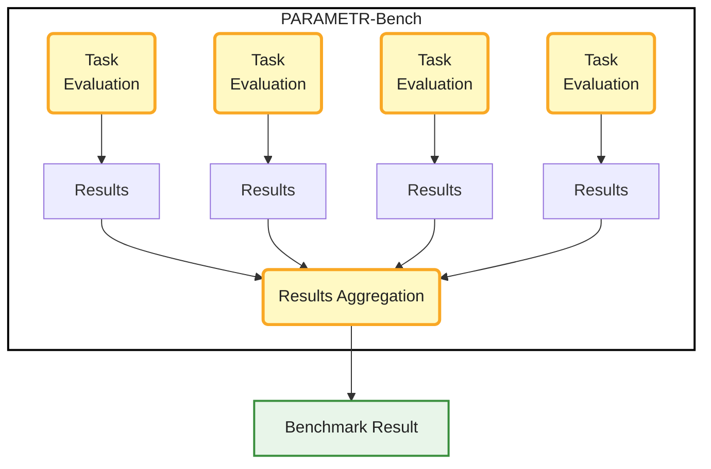
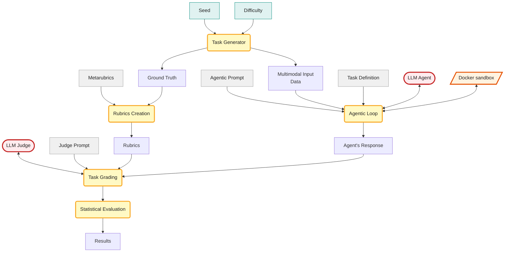

[](https://doi.org/10.5281/zenodo.20076421)
[](https://huggingface.co/spaces/otheiner/PARAMETR-Bench_demo)
[](https://github.com/otheiner/PARAMETR-Bench)

<div class="intro-note" markdown="1">
**Quick introduction:** I'm a particle physicist with a PhD from the University of Geneva during which I conducted research at CERN. There, I searched for new elementary particles, contributed to the Athena software framework (the 5M+ line C++/Python codebase used across the ATLAS experiment, one of the largest scientific collaborations in the world), and to the FASER experiment's trigger and data acquisition system.  More recently, I've been working on reinforcement learning from human feedback (RLHF) platforms, designing physics evaluation tasks for frontier large language models.

Problem design is a long thread in my background. As a high school student, I twice represented the Czech Republic at the International Olympiad on Astronomy and Astrophysics (IOAA), winning bronze medals in 2013 and 2014. Since starting university, I've been an organizer of the Czech Astronomy Olympiad, writing competition problems for students.

PARAMETR-Bench, presented in this article, connects these three threads. It started as a curiosity project, but grew into something I think is worth sharing. Despite the "Bench" in the name, my aim is not to build yet another benchmark, but to show my work and present a few interesting ideas I came across along the way. I welcome any comments, and I'm open to discussion - just [reach out](https://otheiner.github.io/#contact).
</div>

## Table of Contents
{:.no_toc}

* TOC
{:toc}

## Motivation

PARAMETR-Bench grew out of my work on RLHF platforms, where I'm paid to create original multimodal physics problems for LLMs. Tasks have to hit specific difficulty thresholds, and crafting a multimodal task only to discover it's too easy is an expensive mistake. I started looking for a way to tune difficulty quickly, and ended up writing most of my tasks as small data generators in Jupyter notebooks: re-run the notebook to get new data, tweak parameters to add noise or scale up the dataset, and the same task becomes harder in seconds.
From there, I got curious about the other side — could I send these tasks to LLMs and evaluate the results automatically? I built a few tasks for myself and started building PARAMETR-Bench around them.

*Note: To be clear, the tasks in PARAMETR-Bench are not the ones I've submitted to platforms - those are subject to IP agreements. The tasks here are my work done specifically for this framework, and are built around the same workflow I use on RLHF platforms.*

## Tackling Dataset Contamination and Rubric Drift

Traditional benchmarks rely on fixed test sets that are becoming contaminated or saturated. Common solutions are hiding test sets or constantly adding new questions. These approaches either sacrifice benchmark transparency or require unsustainable effort.

Procedural generation is a third approach that solves leakage by creating fresh instances every run. But it introduces a new problem. Tasks where the answer is a single number can be graded easily but more complex tasks, such as multi-step scientific analyses, that need detailed grading criteria (rubrics) are trickier. Keeping rubrics aligned with dynamically generated data is challenging.

[PARAMETR-Bench](https://github.com/otheiner/PARAMETR-Bench/) addresses this. It combines a procedural task generator, a sandboxed environment for AI agents, and an evaluation harness with LLM-as-judge. Crucially, it uses the same generating process that creates the task data to also instantiate the rubrics. [**Metarubrics**](#metarubrics-and-rubrics) are a novel (and surprisingly simple) methodological concept I haven't seen elsewhere that mitigates contamination and prevents rubric drift by construction. Note that the term differs from the educational assessment usage, where 'metarubric' refers to a rubric for evaluating other rubrics. The framework is not restricted to physics - physics is just where my expertise happens to lie - and the PARAMETR-Bench is a proof of concept that might grow in the future into other domains.

## How PARAMETR-Bench Works

PARAMETR-Bench runs multiple evaluation sequences and aggregates their results into a final benchmark score. Each evaluation sequence represents one task at one difficulty level evaluated with one seed. The first diagram shows this high-level structure. The framework executes all sequences and aggregates the results.

<div style="text-align: center; max-width: 400px; margin: 0 auto;" markdown="1">

</div>

When running the benchmark, the user specifies two inputs at the start of a run: a set of seeds and a difficulty level. Each seed produces a distinct task instance and the difficulty level is shared across all sequences in the run. The following diagram shows what happens inside a single task evaluation sequence.

<div style="text-align: center; max-width: 900px; margin: 0 auto;" markdown="1">

</div>

The sequence begins with the task generator, which takes the seed and difficulty level as inputs and produces two outputs: the multimodal input data (images, tables, text files, or a combination) and the ground truth (the correct answers, stored internally and never shown to the model). In parallel, the ground truth is used alongside the user-defined metarubrics to instantiate the rubrics — the specific grading criteria for this exact task instance.

PARAMETR-Bench supports two evaluation modes. In non-agentic mode, the input data is embedded directly in the prompt sent to the model, which can cause context overflow on larger datasets. In this mode, the model has only one shot to return the answer, which is extremely difficult. In agentic mode, the model receives only a description of the input files and an environment to explore them — avoiding the context problem entirely.

In agentic mode, the model enters the agentic loop, where it receives the task definition, the multimodal input data, and an [agentic prompt](https://github.com/otheiner/PARAMETR-Bench/blob/main/src/agentic_prompt.md). Inside the loop, the model interacts with a Docker sandbox — an isolated, network-blocked execution environment — through a set of available tools:

- **Running Python scripts** - executed inside the Docker sandbox, memory-capped at 512 MB, no network access, restricted to a single mounted folder with input data. Only standard Python libraries plus a small task-relevant set of libraries are available.
- **Viewing images** - the framework converts the requested image to base64 and embeds it in the next message.
- **Reading files** - reading text and CSV files from the mounted folder.
- **Writing files** - writing helper files to the mounted folder.
- **Running commands** - a restricted allow-list of exploration commands such as `cd`, `ls`, `grep`, regex-based search and a few other basic shell commands.

The loop continues until the model produces a final response or the maximum number of turns is reached. If the model has not converged by the final turn, it is prompted to report its best result so far.

The LLM judge then receives the model's response alongside the populated rubrics and a [judge prompt](https://github.com/otheiner/PARAMETR-Bench/blob/main/src/judge_prompt.md). It grades the response against each rubric criterion, producing a binary pass or fail for each. These grades feed into statistical evaluation, which aggregates them into a weighted score for this sequence — the sequence's contribution to the final benchmark result.

### Seeded Task Generation with Tunable Difficulty

Task generation in PARAMETR-Bench uses seeded pseudo-random number generators, which is an approach borrowed from Monte-Carlo simulation that I know well through my particle physics background. The same seed always produces the same task instance, while varying the seed produces a virtually infinite stream of fresh ones. This combination of reproducibility and unbounded sampling is the foundation of statistical evaluation in physics, and AI evaluation, viewed as an empirical scientific discipline, benefits from exactly the same property.

Each task also ships with a configuration file that exposes the generator's parameters, grouped into three difficulty levels: easy, medium, and hard. These levels typically differ in dataset size, noise levels, and other parameters that control how challenging the task is to solve.

The [`_count_circles`](https://github.com/otheiner/PARAMETR-Bench/blob/main/tasks/_count_circles/prompt.md) task included in the framework is a useful illustration. Tasks prefixed with an underscore are minimal working examples — not used in evaluation by default, but kept in the repository for demonstration and debugging. The setup is simple: the model receives several images of black circles on a white background and is asked to count the circles in each, then compute the average. With at most 5 circles per image, most modern vision models handle this reliably. With 20 circles per image, even capable models start to miscount. This is precisely where agentic evaluation matters: a model that can write a Python script to detect and count the circles will succeed where direct visual counting fails. The same task, evaluated agentically versus non-agentically, measures qualitatively different capabilities. We will discuss the agentic vs. non-agentic aspect in depth later.

You can try the task generator yourself in the interactive demo hosted on Hugging Face Spaces:

<p style="text-align: center;">
  <a href="https://huggingface.co/spaces/otheiner/PARAMETR-Bench_demo" 
     style="display: inline-block;
            background: linear-gradient(180deg, #ffe066 0%, #ffd21e 40%, #f0b800 100%);
            box-shadow: 0 4px 8px rgba(0,0,0,0.2), inset 0 1px 0 rgba(255,255,255,0.6);
            border: 1px solid #c9960a;
            border-radius: 6px;
            padding: 10px 24px;
            font-family: sans-serif;
            font-size: 14px;
            font-weight: 700;
            color: #1a1a1a;
            text-decoration: none;
            letter-spacing: 0.03em;">
    🤗 Try it yourself!
  </a>
</p>

### Dataset Leak Detection Mechanism

Seeded task generation has an inherent feature: I can generate new tasks of the same difficulty, which makes tasks across different seeds meaningfully comparable. For benchmarking purposes, I propose publishing benchmarking results together with:

- the seeds used in the test
- the difficulty settings
- the evaluated model version
- the model used as a judge
- the exact git commit hash, which references the exact state of the repository so the same results can be reproduced in the future

The data themselves are not published — the exact same data are guaranteed by using the same seeds with the same framework version. This setup enables a leak detection mechanism.

If evaluation data from specific public seeds were to leak into a model's training set, the model might show inflated performance due to memorization. This can in principle(\*) be detected by re-running the benchmark with a fresh set of random seeds. A statistically significant performance gap between public seeds and fresh private seeds would provide an indication of a potential data leak — making contamination detectable in principle, unlike static benchmarks where held-out sets differ in content rather than only in seed.

(\*) *This is currently a hypothesis. To test it, I am setting up an experiment described in the section on the [long-running contamination experiment](#a-long-running-contamination-experiment)*.


### Metarubrics and Rubrics

The user only needs to define the templates (metarubrics) and the framework handles the rest. Metarubrics are analogous to classes in object-oriented programming, while rubrics are specific instances of those classes instantiated with unique parameters for a given task. Each metarubric belongs to one of several categories, which lets the resulting evaluation distinguish between different failure modes — for example, errors in scientific reasoning, errors in image handling, or errors in data manipulation. This grouping approach is used in already established benchmarks.

The user provides a high-level template with placeholders.

```json
"metarubrics": [
    {
      "key": "z_estimation",
      "source": "analyzed_galaxies",
      "category": "image handling",
      "name": "Redshift estimation",
      "description": "Did the model compute that galaxy {galaxy_ID} has redshift {z}, or a value strictly inside the interval [{z_min}, {z_max}]?",
      "weight": 5.0
    }
]
```

The framework populates the template using the ground truth stored in pandas DataFrames from the procedurally generated dataset.

```json
"metarubrics": [
    {
      "key": "z_estimation",
      "name": "Redshift estimation",
      "category": "image handling",
      "weight": 5.0,
      "total": 3,
      "rubrics": [
        {
          "id": 1,
          "criterion": "Did the model compute that galaxy GID075008 has redshift 0.02978, or value strictly inside interval [0.02928 , 0.03028]?"
        },
        {
          "id": 2,
          "criterion": "Did the model compute that galaxy GID104365 has redshift 0.01951, or value strictly inside interval [0.01901 , 0.02001]?"
        },
        {
          "id": 3,
          "criterion": "Did the model compute that galaxy GID173179 has redshift 0.01831, or value strictly inside interval [0.01781 , 0.01881]?"
        }
      ]
    }
]
```

#### Metarubrics Design Guidance

The framework supports static metarubrics (those with no parameters, e.g. "Did the model perform a linear regression?"), but parameterized templates (e.g. "Did the model compute that galaxy {galaxy_ID} has redshift {z}?") are generally preferable. There are two reasons for this: 

1. **Populated criteria depend on the seed**, so the exact answer key for any given run is not present in the published framework — a model exposed to the repository alone cannot memorize the numerical targets. 

2. **Sampling many numerical values across seeds gives a finer-grained signal** than a single procedural check. For example, a partially wrong formula will agree with ground truth on some parameter ranges and disagree on others, and a multi-seed pass-rate makes that visible without the rubric having to name the correct method. 

This indirect approach is not always sufficient (some failure modes are invariant across seeds, and checks using static metarubrics remain useful for those) but where it applies, it allows keeping the ground truth hidden, while still being able to provide more than just a single numeric value check.

### Evaluation Harness for AI Agents

Since PARAMETR-Bench can generate many instances of one task at approximately the same difficulty, it allows treating the LLM as a statistical black box — probing its behavior across multiple trials rather than relying on a single evaluation. Even when the model temperature is set to zero, responses can vary due to non-determinism in sampling and infrastructure. This variance is difficult to quantify from a single experiment, but running multiple seeds across the same task and difficulty level makes it measurable.

Each evaluation sequence proceeds as follows. The model receives the task definition, the multimodal input data, and an agentic prompt. In agentic mode, it interacts with the Docker sandbox through the available tools — running Python scripts, reading files, viewing images — and iterates until it produces a final response or the maximum number of turns is reached. Models are tested with their default parameters, but those that support reasoning also keep their thought thread in between the agentic turns. In non-agentic mode, the full input is embedded in a single prompt and the model responds in one turn.

The model's response is then passed to an LLM-as-judge alongside the populated rubrics and a judge prompt. The judge grades each rubric criterion independently, producing a binary pass or fail for each. These grades are aggregated into a weighted score for the sequence, where each metarubric's weight reflects the relative importance of the corresponding analytical step. Rubrics are grouped into categories — such as scientific reasoning, numerical computation, and data extraction — allowing the aggregate score to be decomposed into per-category pass rates, which makes it possible to identify where a model fails rather than just whether it fails.

All model responses are stored automatically alongside their rubric grades and metadata, so they can be re-analyzed in the future — for example, to study failure modes or to re-grade with an improved judge — without re-running the experiments.

Across multiple seeds at the same difficulty level, per-task pass rates and their confidence intervals can be estimated. This multi-seed design is what makes the [leak detection mechanism](#dataset-leak-detection-mechanism) described earlier empirically testable: performance on public seeds and private seeds can be compared with appropriate statistical tests rather than as point estimates.

## Tasks Included in PARAMETR-Bench

Tasks in the PARAMETR-Bench have a few common features:

1. They are motivated by real science. Some of the tasks are inspired by the Nobel-prize level discoveries that revolutionized fields such as cosmology or particle physics (though the framework is not restricted only to physics).
2. Multi-step nature - tasks consist of multiple steps combining scientific reasoning, data exploration, python code implementation.
3. Data used as an input are multimodal (images, tables, text files)
4. Adversarial by nature and designed to challenge models in things I noticed to be difficult.

Currently, there are four complex physics tasks and two minimal working example tasks in the repository to demonstrate the framework on the simplest cases. These minimal working examples are by default not included when running the whole benchmark, unless the user specifies them. The following paragraphs briefly describe tasks currently included in the framework. For more details, check [Hugging Face Space](https://huggingface.co/spaces/otheiner/PARAMETR-Bench_demo) or `tasks` folder in [GitHub repo](https://github.com/otheiner/PARAMETR-Bench/). 

- [`cepheid_calibration`](https://github.com/otheiner/PARAMETR-Bench/blob/main/tasks/cepheid_calibration/prompt.md): This analysis focuses on the well-known relation between luminosity of Cepheids (type of variable stars) and their period, recreating (though not exactly) the discovery by Henrietta Swan Leavitt, whose foundational contribution to observational cosmology was never recognized with a Nobel Prize. The task requires combining Hubble's law, spectroscopic data of galaxies, and photometric data about Cepheid variables. Beyond basic concepts from astrophysics, it tests methods of physical data analysis such as template cross-correlation in log-λ space.

 


 - [`invariant_mass_reconstruction`](https://github.com/otheiner/PARAMETR-Bench/blob/main/tasks/invariant_mass_reconstruction/prompt.md): A simplified version of an analysis performed by particle physicists at accelerators like the Large Hadron Collider at CERN. The model receives a description of the detector geometry and the simulated detector data - simplified readouts from a silicon tracker and an electromagnetic calorimeter. The data contain events in which an unknown particle decays into an electron-positron pair. For each event, the model must reconstruct the tracks of both particles (fitting a helix to the tracker hits) and combine them to compute the invariant mass of the parent particle. It then plots a histogram of these reconstructed masses across all events, identifies a peak on top of an exponentially decaying background, and extracts the mass and decay width of the unknown particle. Both quantities are drawn fresh from a probability distribution each run, so the model cannot succeed by guessing a memorized particle - it has to perform the full analysis to recover the values. The full real-world version of this analysis is extremely difficult; the task makes a few targeted simplifications that remove sub-problems unrelated to the core analytical chain (particle identification, vertex reconstruction, hit-level noise, shape of the background, ...) while preserving the analytical reasoning the task is designed to test.

 - [`hubble_constant`](https://github.com/otheiner/PARAMETR-Bench/blob/main/tasks/hubble_constant/prompt.md): A data-analysis task inspired by Edwin Hubble's original work, one of the foundational results of observational cosmology. The model analyzes spectroscopic data to identify redshifts of fictitious galaxies, then combines this with Cepheid photometric data for distance calibration, and uses the result to estimate the local rate of cosmic expansion - the Hubble constant. It's effectively the inverse of the Cepheid calibration task, with a different spectral representation. The Hubble constant value is drawn fresh each run from a distribution whose mean is offset from current measurements, preventing the model from guessing a memorized value and forcing it to actually perform the analysis.

 - [`lissajous_figures`](https://github.com/otheiner/PARAMETR-Bench/blob/main/tasks/lissajous_figures/prompt.md): The model is placed in the role of a physicist performing quality assurance at a company manufacturing AC power supplies. The key analytical step is reading Lissajous figures (see the image below) - spatially complex plots produced by combining two oscillating signals - to determine the frequency of the power supply under test. The estimation requires counting the ratio of lobes touching the vertical and horizontal axes of the figure. This is a simple task for human visual inspection but deceptively difficult even for capable vision models, and remains non-trivial even with agentic tool use.

 

Two minimal working examples follow. These tasks are simple and require no physics knowledge, so a potential contributor from a different field can examine the framework without having to understand the physics tasks. Both tasks have names prefixed with an underscore - by convention, tasks in PARAMETR-Bench whose names start with `_` are minimal working examples and are not included in the default benchmark evaluation, but they remain in the repository for demonstration and debugging. Even though both tasks are deliberately simple, they reveal interesting LLM failure modes. They're useful both as framework demonstrations and as small empirical probes of what current models still struggle with.

  - [`_count_circles`](https://github.com/otheiner/PARAMETR-Bench/blob/main/tasks/_count_circles/prompt.md): The model receives several images of black circles on a white background and is asked to count the circles in each, then compute the average. With few circles per image, most vision models handle this easily; with many circles per image, even capable models start to miscount, making this a useful illustration of when agentic evaluation outperforms direct visual reasoning.
  
  - [`_compute_average`](https://github.com/otheiner/PARAMETR-Bench/blob/main/tasks/_compute_average/prompt.md): The model is given a list of numbers and asked to compute their average. Trivially easy in principle, but less capable models sometimes hallucinate the result when the list is long or the numbers contain many decimal places.


## Results

*Note: Presented results were produced by the code at commit [`c7791b7`](https://github.com/otheiner/PARAMETR-Bench/tree/c7791b7b5e5a4d1acb4db35fed3257800b06d1f3)*

In the following results, I tested capabilities of four models: Claude-Sonnet-4.6, Gemini-3.1-Pro (preview - tests performed on 5 June, 2026), GPT-5.4-mini, Qwen3.6-35B-A3B, DeepSeek-V4-Pro. The picked Claude-Haiku-4.5 as a main judge and the Gemini-3.1-Flash-Lite as a reference judge model. Each model was evaluated in two *runs* - each containg 4 seeds (public and private set) on 4 tasks, which resulted in about 1900 yes/no rubric criteria per run and model.
 
Before starting the tests, it was important to decide about the evaluation protocol. I had to balance several constrains - having statistics, running the tests with reasonable tokens budget and making sure that taks are not too difficult, but also not too easy. The last requirement especially is extremely important. I didn't want the tasks to be too hard, or too easy, because I wanted to be able to spot the gaps in model performances. This is why I first did only a small pilot runs with only one seed (0) and I picked the two best performing models (Gemini-3.1-Pro and Claude-Sonnet-4.6). I ran with two different agentic turns budgets and I got:

<style type="text/css">
.tg  {border-collapse:collapse;border-color:#ccc;border-spacing:0;table-layout:fixed;width:400px;margin:0 auto;}
.tg td{background-color:#fff;border-color:#ccc;border-style:solid;border-width:1px;color:#333;
  font-family:Arial, sans-serif;font-size:14px;overflow:hidden;padding:10px 5px;word-break:normal;width:130px;}
.tg th{background-color:#f0f0f0;border-color:#ccc;border-style:solid;border-width:1px;color:#333;
  font-family:Arial, sans-serif;font-size:14px;font-weight:normal;overflow:hidden;padding:10px 5px;word-break:normal;width:130px;}
.tg .tg-abx8{background-color:#c0c0c0;font-weight:bold;text-align:center;vertical-align:top}
.tg .tg-0lax{text-align:center;vertical-align:top}
.tg .tg-y6fn{background-color:#c0c0c0;text-align:center;vertical-align:top}
.tg  {border-collapse:collapse;border-color:#ccc;border-spacing:0;table-layout:fixed;width:400px;margin:0 auto;font-size:12px;}
</style>
<table class="tg"><thead>
  <tr>
    <th class="tg-0lax" style="width:140px;"></th>
    <th class="tg-abx8" style="width:130px;">10 turns</th>
    <th class="tg-abx8" style="width:130px;">15 turns</th>
  </tr></thead>
<tbody>
  <tr>
    <td class="tg-y6fn" style="width:140px;">Claude-Sonnet-4.6</td>
    <td class="tg-0lax" style="width:130px;">42%</td>
    <td class="tg-0lax" style="width:130px;">42%</td>
  </tr>
  <tr>
    <td class="tg-y6fn" style="width:140px;">Gemini-3.1-Pro</td>
    <td class="tg-0lax" style="width:130px;">74%</td>
    <td class="tg-0lax" style="width:130px;">65%</td>
  </tr>
</tbody>
<caption style="caption-side:bottom;">Table 1: Results of the pilot run with one seed (0) to correctly select maximum allowed number of agentic turns.</caption>
</table>

Since using 15 agentic turns signifficantly increases token budget, while no improvement in the performance was observed, I decidet to run all following tests with 10 agentic turns. Since I plan to run experiments in the future to test dataset leakage mechanism (see section about long-running contamination experiment), having the best scoring models around 60% gives me still possibility to observe model improving without (hopefully) saturating the benchmark in the future. 

 

 

### Evaluation Protocol

number of turns, agentic vs. nonagentic

### Judge Reliability



### Difficulty Scaling

### Model Capabilities by Dimensions

Rubric criteria are split into four dimensions: data handling, image data extraction, scientific reasoning, instruction following and each model was also evaluated accross these dimentions by grouping weighted rubrics from these dimensions together. Each dimension is evaluated independently, so if the model would fullfill all rubrics from one dimension, it would score 100% dimension, but it wouldn't influence scores in other dimensions.

It is important to say that even though these dimensions test different capabilities, they are not entirely independent. Rubric criteria that are dependent on previous steps that failed, will also likely fail. For this reason, results in the following histogram should be only viewed as an approximate qualitative analysis.



Even if these results give us only approximate idea about model performance, it can be seen that models scored the lowest in the image data extraction. The image extractions step is usually early in the analysis because it requires extracting data for the further analysis. For this reason, this step is in the presented tasks usually mostly independent of others. On the other hand, scientific reasoning also covers rubrics checking for the correctness of the final result and that is what renders these scores lower.

### A Long-Running Contamination Experiment

The seeded-generation design provides a theoretical contamination resistance - but a theoretical property is not an empirical one. To actually test whether contamination is detectable in practice, the published evaluation set needs to leak into model training data, and then I need a way to measure that it leaked.

I cannot force a leak to happen, but I can make it as likely as possible. The strategy is to publish the public seed set together with results now, and to wait several months until the next generation of models is trained on web data crawled in the meantime. Unlike most benchmarks - which try to mitigate the risk of dataset leakage - I am deliberately maximizing the probability of leakage for a specific, pre-registered subset of seeds.

The measurement comes from the comparison between two seed sets evaluated on the same future model:

<div style="color:red; font-weight:bold;">Disclaimer: The dataset on Hugging Face will be published soon (after running the experiments).</div>
- A **public seed set**, published now along with the corresponding generated input data on [Hugging Face](https://huggingface.co/datasets/otheiner/PARAMETR-Bench).
- A **private seed set**, drawn from the same generator distribution at the same difficulty levels but withheld from publication.



At publication time, both sets are equivalent: same generator, same parameters, same statistical properties. If a model trained months from now has been exposed to the public seed set, its performance on those seeds should be measurably higher than its performance on the held-out private seeds. A statistically significant gap would constitute evidence of contamination; a null result would constitute evidence that the framework's contamination resistance survives even direct exposure.

To maximize the chances of leakage being detectable, I am publishing not only the seeds themselves but also the generated input data — images, tables, and ground-truth artifacts produced from those seeds. Web crawlers are far more likely to ingest static data files than to execute a generator script, so this raises the prior probability of contamination occurring at all.

This is a slow experiment by design. The first contamination signal cannot arrive until at least one new model generation has been trained, so the most informative results from this experiment will appear in follow-up posts over the coming months and years.

## Related work

Several benchmarks address contamination through dynamic test sets rather than fixed ones, falling into two broad families.

The first family relies on procedural generation. DyVal[^dyval] uses directed acyclic graphs to generate reasoning tasks in mathematics, logic, and algorithms. BALROG[^balrog] evaluates agents in procedurally generated game environments. PhysGym[^physgym] uses procedurally generated physics simulations, but targets physics discovery (probing unknown laws through experimentation) rather than multi-step data analysis. These benchmarks share PARAMETR-Bench's contamination-resistance motivation but target abstract reasoning, game-playing, or physics discovery rather than scientific analysis.

The second family relies on expert-curated tasks that are periodically refreshed. LiveBench[^livebench] releases new questions monthly, drawn from recent math competitions, arXiv papers, and news articles. This mitigates contamination in practice but depends on continuous human authoring effort and on newly released sources not yet having been crawled.

A third group targets scientific analysis directly but uses static, expert-curated tasks. ScienceAgentBench[^scienceagentbench] evaluates agents on 102 data-driven scientific tasks extracted from peer-reviewed publications, and BixBench[^bixbench] evaluates agents on real-world bioinformatics scenarios in Dockerized environments, both structurally similar to PARAMETR-Bench in their agentic setup. SciCode[^scicode] covers scientific coding across 16 sub-fields of natural science. These are the closest in scientific scope to PARAMETR-Bench, but their static nature leaves them vulnerable to contamination over time.

PARAMETR-Bench sits at the intersection of the first and third families: procedural generation applied to multi-step scientific analysis. This combination introduces a challenge that neither family faces in isolation, which is keeping detailed grading criteria aligned with the ground truth that varies across runs. Static scientific benchmarks can ship hand-written rubrics because answers never change, while procedural reasoning or game benchmarks typically grade on a single objective outcome that needs no rubric. Multi-step scientific analysis needs both fresh instances every run and fine-grained rubrics. The metarubric mechanism addresses this by auto-populating rubrics from the same generator that produces the task, preventing rubric drift by construction. I am not aware of prior work that combines procedural generation with scientific analysis tasks, nor of a direct equivalent of the metarubric mechanism, though I cannot rule out related efforts I may have missed.

## Limitations and What's Next

PARAMETR-Bench is presented as a methodology and proof of concept rather than a finished benchmark — nor is becoming one its goal. The framework demonstrates that procedural generation and auto-populated rubrics can be combined for multi-step scientific analysis, but I would like to use this section to acknowledge several limitations.

**Metarubrics inherit generator behavior.** Rubric criteria are auto-populated from the same generator that produces the task data, so any bug or systematic bias in the generator propagates into every derived rubric instance. Static benchmarks catch such errors per task during human review; here, validation has to happen at the generator level instead.

**LLM-as-judge limitations apply.** The framework currently relies on an LLM judge to grade responses against populated rubrics, inheriting the known failure modes of LLM-as-judge evaluation: sensitivity to verbosity, possible same-family bias, and unreliability on borderline cases. Reported results are entangled with the choice of judge model, which is why the proposed reporting format includes it alongside the evaluated model.

**Contamination detection is currently theoretical.** The leak-detection mechanism works in principle. A statistically significant gap between public and private seeds would indicate contamination, but whether such a gap is detectable in practice has yet to be demonstrated. Until the long-running experiment produces results, contamination resistance should be read as a design property rather than a demonstrated capability.

**Producing statistically meaningful results is expensive.** Reliably quantifying the variance of a model's responses requires running evaluations across many seeds — and increasing the sample size, while reducing statistical uncertainty, scales the cost of API calls proportionally. As an independent researcher running this framework as a curiosity project, I have chosen to prioritize a modest seed count that keeps costs manageable while still providing indicative results. Reducing statistical uncertainty further would require spending significantly more on inference tokens for diminishing marginal gains.

**Difficulty levels are assumed.** Each task can be generated at three difficulty levels: `easy`, `medium`, and `hard`. These levels are defined by increasing dataset size, stronger noise effects, and the inclusion of edge cases that a human solver would consider more challenging. While it is reasonable to assume that similar difficulty scaling applies to LLMs, this remains an assumption until confirmed empirically — the validity of the parametric difficulty scaling is empirically demonstrated by the experimental results presented in this post.

**Procedural generation suits some scientific tasks better than others.** The framework works naturally for tasks with a parametric structure — number of events, noise levels, true values of physical constants, and dataset size. Many forms of scientific reasoning, such as deciding which experiment to run next or recognizing that a model assumption is wrong, do not factorize this way. PARAMETR-Bench measures a specific slice of scientific competence — multi-step quantitative analysis with well-defined ground truth — and is not intended as a general measure of scientific reasoning.

**Scope of this work.** This post presents methodology and a working implementation, not a benchmark broad enough to rank frontier models. Doing the latter would require more tasks, more domains, multiple contributors, and the contamination experiment running to completion. The goal here is to put the methodological ideas — seeded scientific task generation, metarubrics, and the leak-detection design — on the table for discussion before possibly scaling further.

## Conclusion

<div style="color:red; font-weight:bold;">Disclaimer: This section will be added soon.</div>

## References

[^dyval]: Zhu, K., et al. (2023). *DyVal: Dynamic Evaluation of Large Language Models for Reasoning Tasks*. [arXiv:2309.17167](https://arxiv.org/abs/2309.17167).

[^balrog]: Paglieri, D., et al. (2024). *BALROG: Benchmarking Agentic LLM and VLM Reasoning On Games*. ICLR 2025. [arXiv:2411.13543](https://arxiv.org/abs/2411.13543).

[^physgym]: Chen, Y., et al. (2025). *PhysGym: Benchmarking LLMs in Interactive Physics Discovery with Controlled Priors*. NeurIPS 2025 Datasets and Benchmarks Track. [arXiv:2507.15550](https://arxiv.org/abs/2507.15550).

[^livebench]: White, C., et al. (2024). *LiveBench: A Challenging, Contamination-Limited LLM Benchmark*. [arXiv:2406.19314](https://arxiv.org/abs/2406.19314).

[^scienceagentbench]: Chen, Z., et al. (2024). *ScienceAgentBench: Toward Rigorous Assessment of Language Agents for Data-Driven Scientific Discovery*. ICLR 2025. [arXiv:2410.05080](https://arxiv.org/abs/2410.05080).

[^bixbench]: Mitchener, L., et al. (2025). *BixBench: A Comprehensive Benchmark for LLM-based Agents in Computational Biology*. [arXiv:2503.00096](https://arxiv.org/abs/2503.00096).

[^scicode]: Tian, M., et al. (2024). *SciCode: A Research Coding Benchmark Curated by Scientists*. NeurIPS 2024. [arXiv:2407.13168](https://arxiv.org/abs/2407.13168).
